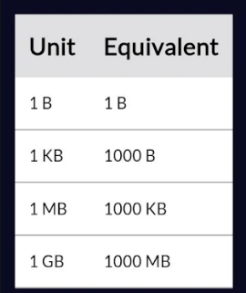

Given a file size, a unit for the file size, and hard drive capacity in gigabytes (GB), return the number of files the hard drive can store using the following constraints:

• The unit for the file size can be bytes ("B"), kilobytes ("KB"), or megabytes 
• Return the number of whole files the drive can fit.• Use the following conversions:

For example, given 500, "KB", and 1 as arguments, determine how many 500 KB files can fit on a 1 GB hard drive